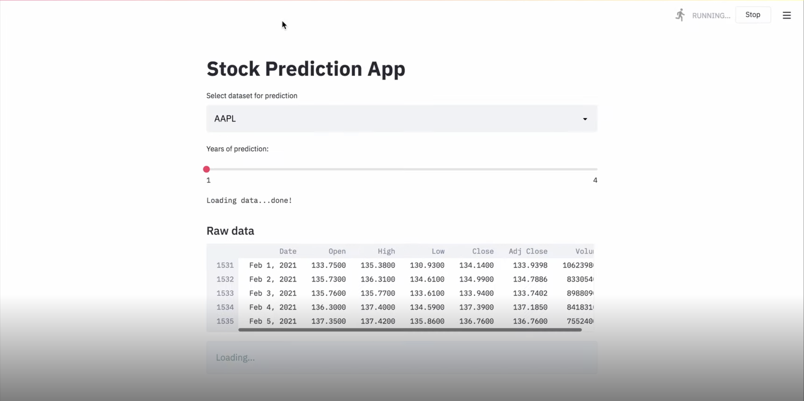
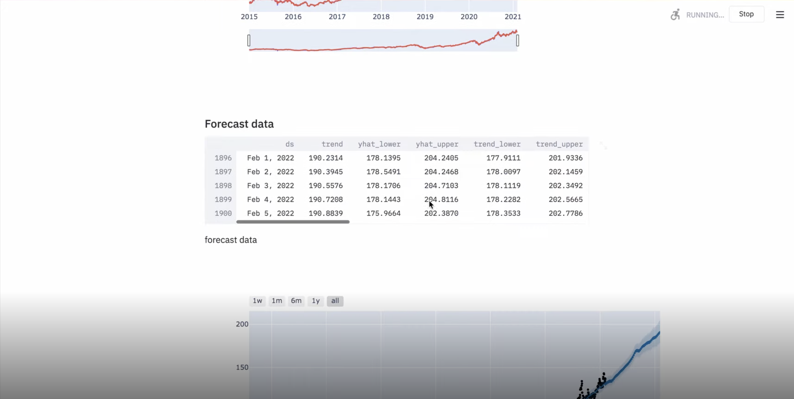
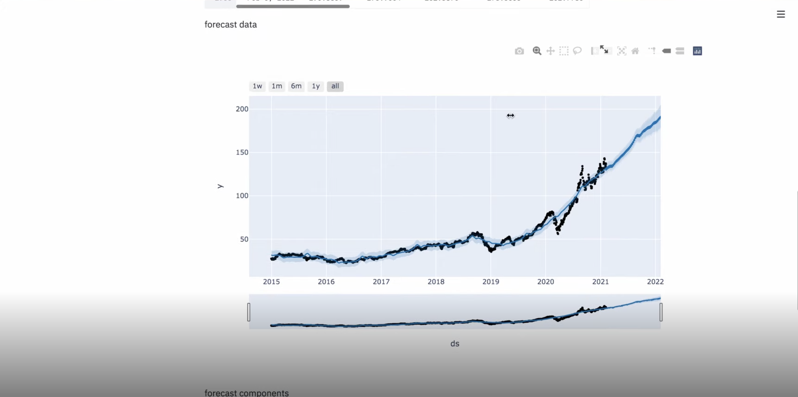

# 📈 Stock Prediction App

A simple Streamlit web app to fetch historical stock data and forecast future prices using Facebook’s Prophet model.

---

## 🔍 Demo

### 1. Select Ticker & Forecast Horizon  


### 2. Raw Data Table  


### 3. Forecast Data Table  


### 4. Forecast Plot  


---

## 🛠️ Installation

1. **Clone the repository**  
   ```bash
   git clone https://github.com/your-username/stock-prediction-app.git
   cd stock-prediction-app
Create and activate a virtual environment

bash

python3 -m venv venv
source venv/bin/activate       # macOS/Linux
# .\venv\Scripts\activate      # Windows PowerShell
Install dependencies

bash

pip3 install streamlit fbprophet yfinance plotly
🚀 Usage
Run the app

bash

streamlit run app.py
In your browser, choose:

Dataset: e.g. AAPL, GOOG, MSFT

Years of prediction slider

View raw data, forecast table, and interactive plot with confidence intervals.

📦 Requirements
Python 3.7+

Streamlit

fbprophet

yfinance

plotly
